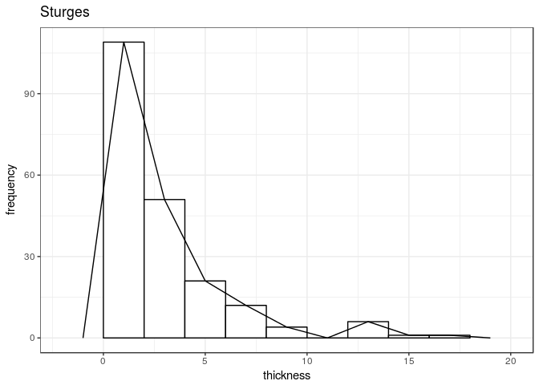
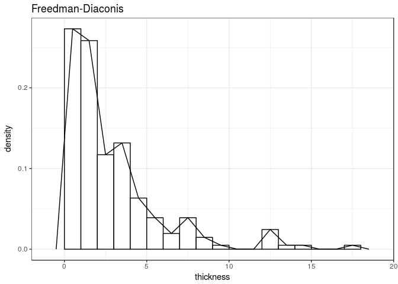
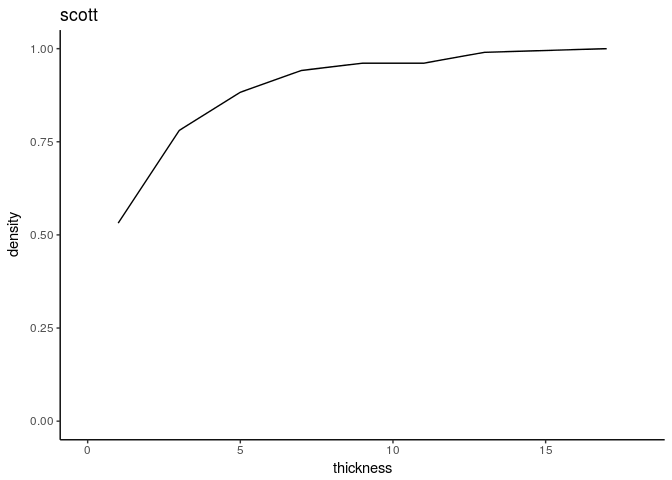
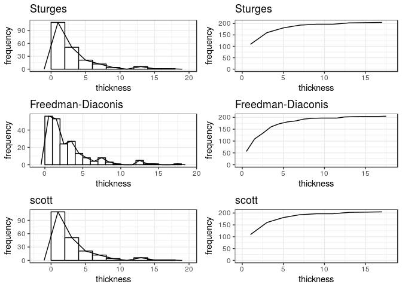

<!-- README.md is generated from README.Rmd. Please edit that file -->
histogramR
==========

Overview
--------

histogramR is a tool based on dplyr and ggplot2 that creates classical frequency distribution tables, histograms and frequency polygons. Also, a comparison between number of classes compute methods (Sturges, Friedman-Diaconis and Scott) are performed. This package is part of a final work in Computational Statistics course at the Master of Applied Statistics in Universidad del Norte, Colombia.

Installation
------------

histogramR is stored in this github repository, thus package devtools is needed to install. If you are on a fresh install of R, then following code will install a lot of packages.

``` r
install.packages("devtools")
devtools::install_github("rodianf/histogramR")

library(histogramR)
```

Usage
-----

### tab\_freq

This function creates a classical frequency distribution table, of class tibble, with five columns.

-   **variable name**: Class intervals computed by selected method, default is "Sturges".

-   **f**: Counts or frequency of the variable in a class interval.

-   **rf**: Relative frequency or density.

-   **cf**: Cummulative frequency.

-   **crf**: Cummulative relative frequency.

As the return object is a tibble, functions from dplyr can be applied. To include in Rmarkdown use `knitr::kable` for better results.

#### Note

Classes with zero frequency are dropped from table. This is caused by function `group_by` from dplyr package, however a correction for this behavior will be implemented soon. See <https://github.com/tidyverse/dplyr/pull/3492>.

``` r
library(MASS)
#> 
#> Attaching package: 'MASS'
#> The following object is masked from 'package:dplyr':
#> 
#>     select

data("Melanoma")

attach(Melanoma)

tab_freq(thickness)
#> # A tibble: 8 x 5
#>   thickness     f      rf    cf   crf
#>   <chr>     <int>   <dbl> <int> <dbl>
#> 1 [0, 2)      109 0.532     109 0.532
#> 2 [2, 4)       51 0.249     160 0.780
#> 3 [4, 6)       21 0.102     181 0.883
#> 4 [6, 8)       12 0.0585    193 0.941
#> 5 [8, 10)       4 0.0195    197 0.961
#> 6 [12, 14)      6 0.0293    203 0.990
#> 7 [14, 16)      1 0.00488   204 0.995
#> 8 [16, 18]      1 0.00488   205 1.00

tab_freq(thickness, nclass = "FD")
#> # A tibble: 14 x 5
#>    thickness     f      rf    cf   crf
#>    <chr>     <int>   <dbl> <int> <dbl>
#>  1 [0, 1)       56 0.273      56 0.273
#>  2 [1, 2)       53 0.259     109 0.532
#>  3 [2, 3)       24 0.117     133 0.649
#>  4 [3, 4)       27 0.132     160 0.780
#>  5 [4, 5)       13 0.0634    173 0.844
#>  6 [5, 6)        8 0.0390    181 0.883
#>  7 [6, 7)        4 0.0195    185 0.902
#>  8 [7, 8)        8 0.0390    193 0.941
#>  9 [8, 9)        3 0.0146    196 0.956
#> 10 [9, 10)       1 0.00488   197 0.961
#> 11 [12, 13)      5 0.0244    202 0.985
#> 12 [13, 14)      1 0.00488   203 0.990
#> 13 [14, 15)      1 0.00488   204 0.995
#> 14 [17, 18]      1 0.00488   205 1.00

tab_freq(thickness) %>% 
  rename("Frequency" = f,
         "Relative frequency" = rf)
#> # A tibble: 8 x 5
#>   thickness Frequency `Relative frequency`    cf   crf
#>   <chr>         <int>                <dbl> <int> <dbl>
#> 1 [0, 2)          109              0.532     109 0.532
#> 2 [2, 4)           51              0.249     160 0.780
#> 3 [4, 6)           21              0.102     181 0.883
#> 4 [6, 8)           12              0.0585    193 0.941
#> 5 [8, 10)           4              0.0195    197 0.961
#> 6 [12, 14)          6              0.0293    203 0.990
#> 7 [14, 16)          1              0.00488   204 0.995
#> 8 [16, 18]          1              0.00488   205 1.00

tab_freq(thickness, nclass = "scott") %>% 
  rename("Frequency" = f,
         "Relative frequency" = rf) %>% 
  knitr::kable()
```

| thickness  |  Frequency|  Relative frequency|   cf|        crf|
|:-----------|----------:|-------------------:|----:|----------:|
| \[0, 2)    |        109|           0.5317073|  109|  0.5317073|
| \[2, 4)    |         51|           0.2487805|  160|  0.7804878|
| \[4, 6)    |         21|           0.1024390|  181|  0.8829268|
| \[6, 8)    |         12|           0.0585366|  193|  0.9414634|
| \[8, 10)   |          4|           0.0195122|  197|  0.9609756|
| \[12, 14)  |          6|           0.0292683|  203|  0.9902439|
| \[14, 16)  |          1|           0.0048780|  204|  0.9951220|
| \[16, 18\] |          1|           0.0048780|  205|  1.0000000|

### plot\_freq

This function creates an histogram and frequency polygon or a cummulative frequency polygon. The return object is a ggplot2 plot, thus layers can be applied.

``` r
plot_freq(thickness)
```



``` r

plot_freq(thickness, nclass = "FD", density = TRUE)
```



``` r

plot_freq(thickness, nclass = "scott", density = TRUE, cfp = TRUE) +
  theme_classic()
```



### nc\_comp

This function compare the methods for calculation of the number of classes from a numerical random variable. Uses `plot_freq` function to generate plots. Generics as `print`, `summary` and `ggplot` can be used.

``` r
nc_comp(thickness)
#> Class number methods comparison.
#> 
#>    method nclasses
#> 1 Sturges        9
#> 2      FD       20
#> 3   scott       10

comparison <- nc_comp(thickness)

print(comparison)
#> Class number methods comparison.
#> 
#>    method nclasses
#> 1 Sturges        9
#> 2      FD       20
#> 3   scott       10

summary(comparison)
#> Class number methods comparison.
#> 
#>    method nclasses
#> 1 Sturges        9
#> 2      FD       20
#> 3   scott       10
#> 
#> Summary of input vector:
#> 
#>    Min. 1st Qu.  Median    Mean 3rd Qu.    Max. 
#>    0.10    0.97    1.94    2.92    3.56   17.42

ggplot(comparison)
```


